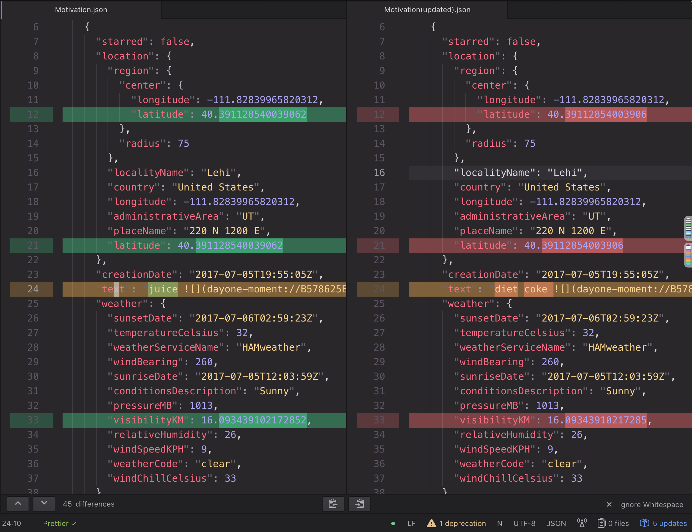
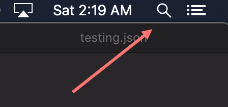

# Day One Journal - Find And Replace

Find and replace text for Day One JSON exports.



## Getting Started

Instructions for how to run the script locally on your computer.

### Prerequisites

It is preferred you own a Mac with Day One on it.

If you do NOT own a Mac, but have access to a Mac, you may export your journals to JSON from the iOS client and AirDrop them to the Mac.

### Instructions

1. Export your Day One Journals as JSON. (File -> Export -> JSON)
2. Unzip your exported journals.
3. Download the ZIP file of THIS project or if you're tech savvy clone this project. (Green Button)
4. Locate the project you just downloaded and unzip it.
5. For ease of use later, put your exported journals folder(the unzipped one) along side this projects directory.
6. Also for ease of use, rename your exported journals directory from `Export - All Entries (2018-11-24)` to `journals`
7. Using Mac's built in finder(spotlight), search for `Terminal`.



8. Type `ls` to view the directories on your Mac.
9. Assuming you still have the project in your `Downloads` folder, type `cd Downloads`
10. Type `cd DayOne-Find-And-Replace-master`

This script was made in Python, and fortunately Mac ships with Python!

11. Type `python main.py --word-replaced veggies --word-replacing pizza`

#### Waaaaaaaaaaaaait!

Before you hit enter. You need to change `veggies` to the word you want to be replaced in your journal(s), and `pizza` with the one you want to take it's place.

#### Pro Tip:
If you want to change `juice` to `diet coke` you will have to include a back slash to take into account the space. So for example:

```
python main.py --word-replaced juice --word-replacing diet\ coke
```

Now you have two options. You can either give the script one single journal, or all the journals.

### All Journals

If you followed step 5 and 6, the path to the file should be correct.

12. Going back to what we typed, finish typing it `python main.py --word-replaced veggies --word-replacing pizza --folder-in ../journals`

### One Journal

12. Now instead of typing a directory, we will just give the path of the file, for example: `python main.py --word-replaced veggies --word-replacing pizza --file-in journals/My Smelly ../Journal.json`

13. Hit enter!

It will create a duplicate of the file with the text `(updated)` on the end.

Either confirm everything is correct before importing, or just import 😃(keep the backup temporarily just in case)

14. Zip up your journals, by right clicking on your directory(`journals`) and clicking `compress`

15. Import journal back into Day One! (File -> Import -> JSON Zip File)

Voila! You're done! Enjoy!

## Note

I did a diff on the files, and unfortunately there was a slight loss when I probably loaded in the JSON in Python. It also could have happened when I wrote the file out, but the large numbers that Day One stores get slightly tweaked. The three that I've seen change are `latitude`, `longitude`, and `visibilityKM`. Doesn't seem like a big deal to me, but if you want to fix it, then by all means PR's are accepted. (:

---

[Twitter - @hossman333](https://twitter.com/hossman333)

---

## License

This project is licensed under the MIT License - see the [LICENSE.md](LICENSE.md) file for details
